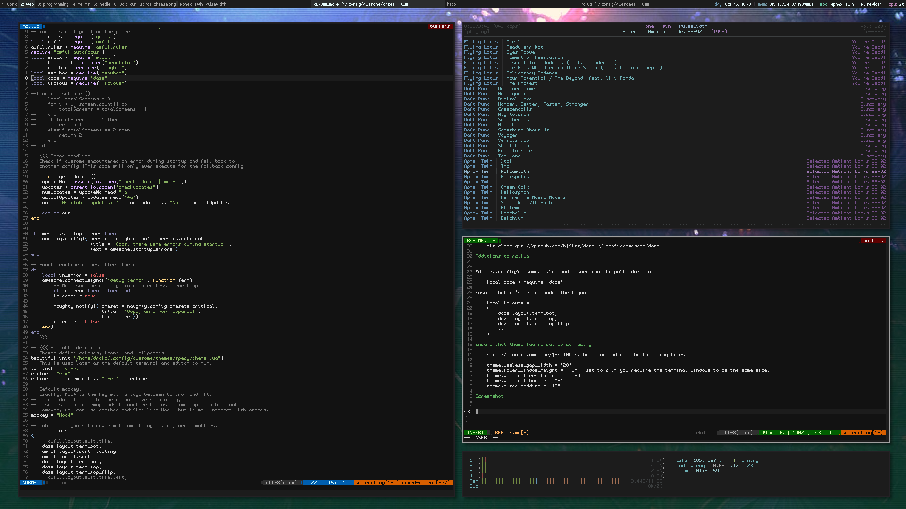

Daze
====

A module for awesome that handles cleaner tiling and a main focus window.

Installation
=============

Clone the repo

    git clone git://github.com/hjfitz/daze ~/.config/awesome/daze

Additions to rc.lua
===================

Edit ~/.config/awesome/rc.lua and ensure that it pulls daze in

    local daze = require("daze") 

Ensure that it's set up under the layouts:

    local layouts =
    {
        daze.layout.term_bot,
        daze.layout.term_top,
        daze.layout.term_top_flip,
        ...
    }

Ensure that theme.lua is set up correctly
=========================================
    Edit ~/.config/awesome/$SETTHEME/theme.lua and add the following lines

    theme.useless_gap_width = "20"
    theme.lower_window_height = "72" --set to 0 if you require the terminal windows to be the same size.
    theme.vertical_resolution = "1080"
    theme.vertical_border = "8"
    theme.outer_padding = "18"

Screenshot
==========

